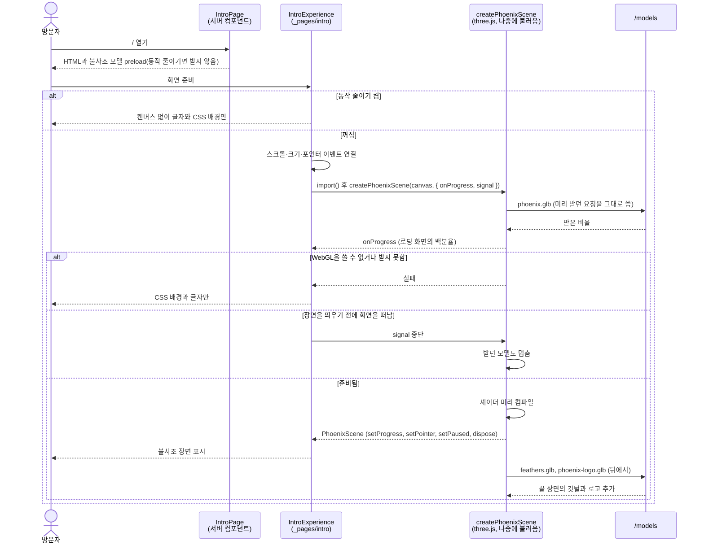
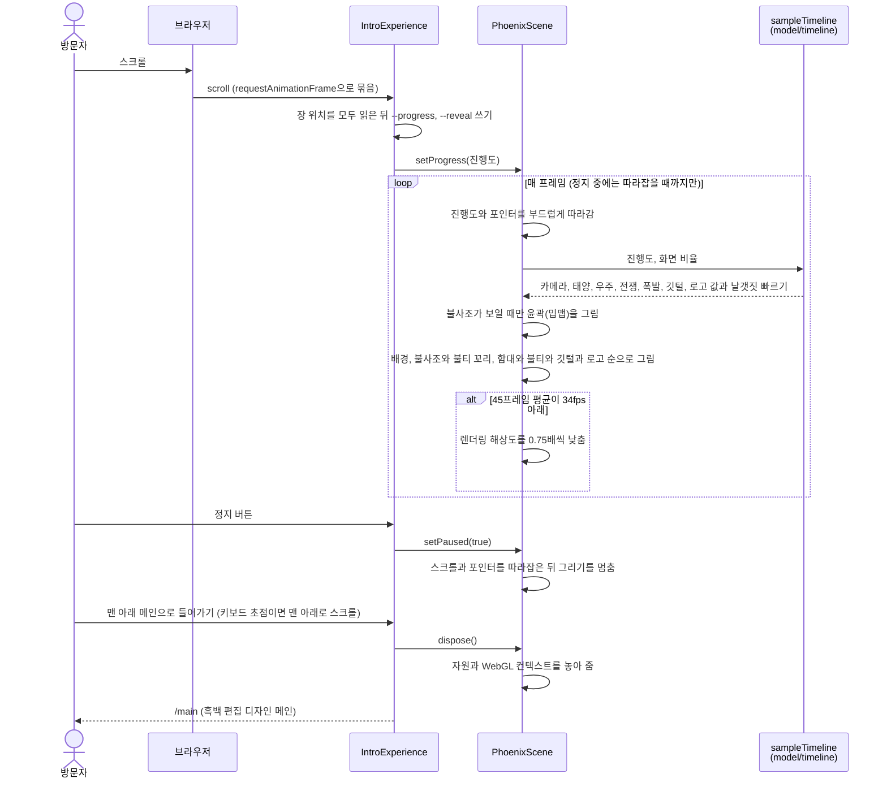

# 시퀀스 다이어그램

project zero 홍보 홈페이지는 서버 데이터 없이 정적으로 동작합니다. 핵심은 스크롤로 움직이는 인트로 장면입니다.

## 1. 인트로 장면 준비

불사조 모델은 HTML에서 미리 받기 시작하고, 장면은 불사조만 받으면 띄웁니다. 깃털·로고는 그 뒤에 받습니다.

```mermaid
sequenceDiagram
    actor 방문자
    participant 페이지 as IntroPage<br/>(서버 컴포넌트)
    participant 인트로 as IntroExperience<br/>(_pages/intro)
    participant 장면 as createPhoenixScene<br/>(three.js, 나중에 불러옴)
    participant 모델 as /models

    방문자->>페이지: / 열기
    페이지-->>방문자: HTML과 불사조 모델 preload(동작 줄이기면 받지 않음)
    방문자->>인트로: 화면 준비
    alt 동작 줄이기 켬
        인트로-->>방문자: 캔버스 없이 글자와 CSS 배경만
    else 꺼짐
        인트로->>인트로: 스크롤·크기·포인터 이벤트 연결
        인트로->>장면: import() 후 createPhoenixScene(canvas, { onProgress, signal })
        장면->>모델: phoenix.glb (미리 받던 요청을 그대로 씀)
        모델-->>장면: 받은 비율
        장면-->>인트로: onProgress (로딩 화면의 백분율)
        alt WebGL을 쓸 수 없거나 받지 못함
            장면-->>인트로: 실패
            인트로-->>방문자: CSS 배경과 글자만
        else 장면을 띄우기 전에 화면을 떠남
            인트로->>장면: signal 중단
            장면->>장면: 받던 모델도 멈춤
        else 준비됨
            장면->>장면: 셰이더 미리 컴파일
            장면-->>인트로: PhoenixScene (setProgress, setPointer, setPaused, dispose)
            인트로-->>방문자: 불사조 장면 표시
            장면->>모델: feathers.glb, phoenix-logo.glb (뒤에서)
            모델-->>장면: 끝 장면의 깃털과 로고 추가
        end
    end
```

## 2. 스크롤에 따른 장면 진행과 메인으로 이동

```mermaid
sequenceDiagram
    actor 방문자
    participant 창 as 브라우저
    participant 인트로 as IntroExperience
    participant 장면 as PhoenixScene
    participant 타임라인 as sampleTimeline<br/>(model/timeline)

    방문자->>창: 스크롤
    창->>인트로: scroll (requestAnimationFrame으로 묶음)
    인트로->>인트로: 장 위치를 모두 읽은 뒤 --progress, --reveal 쓰기
    인트로->>장면: setProgress(진행도)
    loop 매 프레임 (정지 중에는 따라잡을 때까지만)
        장면->>장면: 진행도와 포인터를 부드럽게 따라감
        장면->>타임라인: 진행도, 화면 비율
        타임라인-->>장면: 카메라, 태양, 우주, 전쟁, 폭발, 깃털, 로고 값과 날갯짓 빠르기
        장면->>장면: 불사조가 보일 때만 윤곽(밉맵)을 그림
        장면->>장면: 배경, 불사조와 불티 꼬리, 함대와 불티와 깃털과 로고 순으로 그림
        alt 45프레임 평균이 34fps 아래
            장면->>장면: 렌더링 해상도를 0.75배씩 낮춤
        end
    end
    방문자->>인트로: 정지 버튼
    인트로->>장면: setPaused(true)
    장면->>장면: 스크롤과 포인터를 따라잡은 뒤 그리기를 멈춤
    방문자->>인트로: 맨 아래 메인으로 들어가기 (키보드 초점이면 맨 아래로 스크롤)
    인트로->>장면: dispose()
    장면->>장면: 자원과 WebGL 컨텍스트를 놓아 줌
    인트로-->>방문자: /main (흑백 편집 디자인 메인)
```
