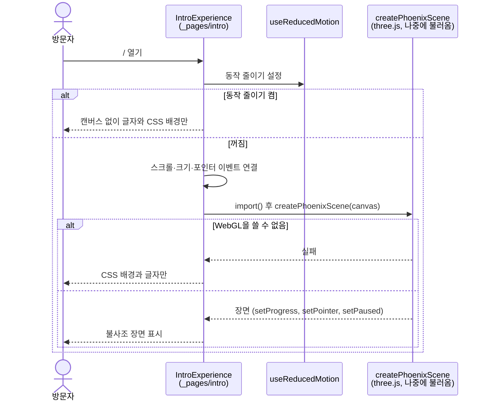
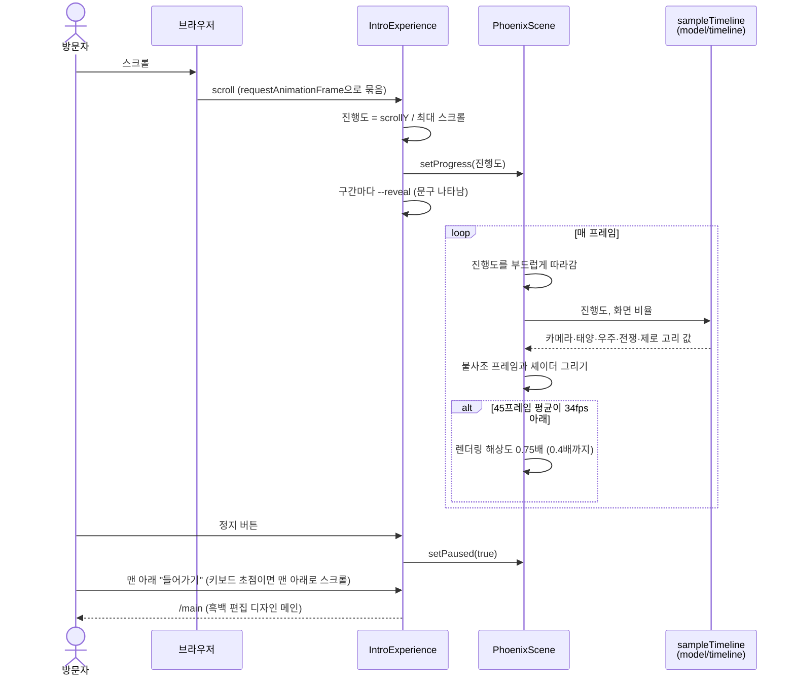

# 시퀀스 다이어그램

project zero 홍보 홈페이지는 서버 데이터 없이 정적으로 동작합니다. 핵심은 스크롤로 움직이는 인트로 장면입니다.

## 1. 인트로 장면 준비

```mermaid
sequenceDiagram
    actor 방문자
    participant 인트로 as IntroExperience<br/>(_pages/intro)
    participant 설정 as useReducedMotion
    participant 장면 as createPhoenixScene<br/>(three.js, 나중에 불러옴)

    방문자->>인트로: / 열기
    인트로->>설정: 동작 줄이기 설정
    alt 동작 줄이기 켬
        인트로-->>방문자: 캔버스 없이 글자와 CSS 배경만
    else 꺼짐
        인트로->>인트로: 스크롤·크기·포인터 이벤트 연결
        인트로->>장면: import() 후 createPhoenixScene(canvas)
        alt WebGL을 쓸 수 없음
            장면-->>인트로: 실패
            인트로-->>방문자: CSS 배경과 글자만
        else
            장면-->>인트로: 장면 (setProgress, setPointer, setPaused)
            인트로-->>방문자: 불사조 장면 표시
        end
    end
```

## 2. 스크롤에 따른 장면 진행과 메인으로 이동

```mermaid
sequenceDiagram
    actor 방문자
    participant 창 as 브라우저
    participant 인트로 as IntroExperience
    participant 장면 as PhoenixScene
    participant 타임라인 as sampleTimeline<br/>(model/timeline)

    방문자->>창: 스크롤
    창->>인트로: scroll (requestAnimationFrame으로 묶음)
    인트로->>인트로: 진행도 = scrollY / 최대 스크롤
    인트로->>장면: setProgress(진행도)
    인트로->>인트로: 구간마다 --reveal (문구 나타남)
    loop 매 프레임
        장면->>장면: 진행도를 부드럽게 따라감
        장면->>타임라인: 진행도, 화면 비율
        타임라인-->>장면: 카메라·태양·우주·전쟁·제로 고리 값
        장면->>장면: 불사조 프레임과 셰이더 그리기
        alt 45프레임 평균이 34fps 아래
            장면->>장면: 렌더링 해상도 0.75배 (0.4배까지)
        end
    end
    방문자->>인트로: 정지 버튼
    인트로->>장면: setPaused(true)
    방문자->>인트로: 맨 아래 "들어가기" (키보드 초점이면 맨 아래로 스크롤)
    인트로-->>방문자: /main (흑백 편집 디자인 메인)
```
